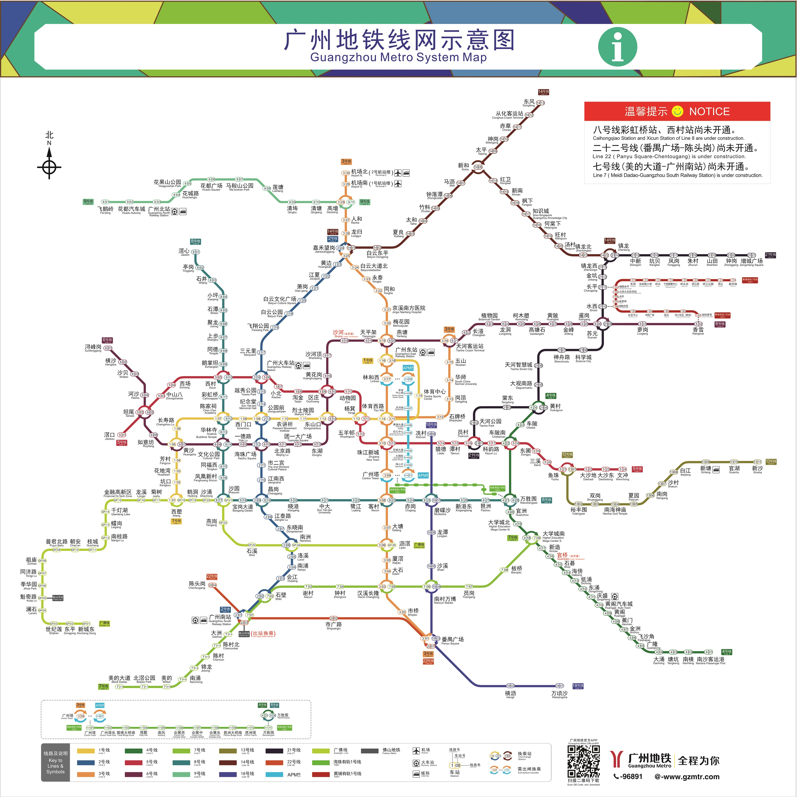

> **当前页是：** docs\README.md
# Hello VuePress

兄弟们使用Github Actions构建

[当前页](./README.md)  
[other目录下的首页](./other/README.md)  
[other目录下的test页面](./other/test.md)  
[other目录下的noTitle页面](./other/noTitle.md)  

<!-- 第一种 公共路径 两者等价 docs\.vuepress\public\images路径 但是一旦生产你有contextpath，则这里也需要设置添加contextpath，上去，非常脆弱，所以 作者推荐第三种相对路径的方式 -->

<!-- 第二种 自动添加base的配置  即contextpath，不过写法麻烦，不推荐，依然建议使用相对路径方式-->
<!--  -->

<!-- 第三种 相对路径 -->
